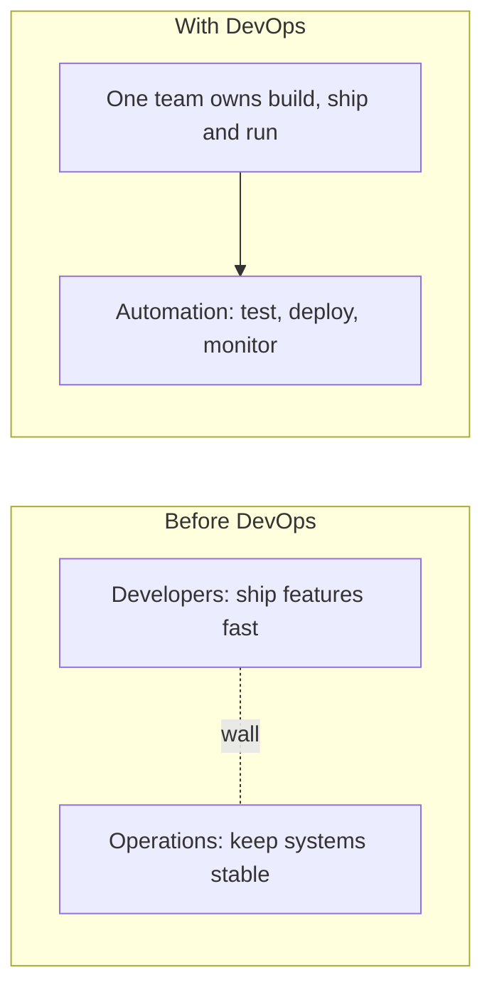
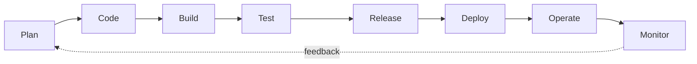

# Day 01 · DevOps Fundamentals

📅 **Date:** 02 Oct 2026 · ⏱️ **Time:** ~2 hrs · 🎥 **Source:** Abhishek Veeramalla, "Day-1 | Fundamentals of DevOps"

## 📌 At a glance

| | |
|---|---|
| **Topic** | What DevOps is and why it exists |
| **Key idea** | DevOps is a culture and set of practices, not a tool |
| **Outcome** | Can explain DevOps clearly in an interview |

---

## 1. What is DevOps?

**DevOps = Development + Operations.**

It is a culture and set of practices in which development and operations teams work together to build, test, release and run software faster and more reliably.

- **Development (Dev):** designs and writes the code.
- **Operations (Ops):** deploys it, keeps it running and fixes problems.

> DevOps is **not** a tool, a single job title, or "developers doing ops". Tools support DevOps. They do not replace the culture.

## 2. The problem before DevOps

- Developers and operations had **opposite goals** (change vs. stability).
- Code was "thrown over the wall", which led to the classic *"works on my machine"* problem.
- Failures led to a **blame game** instead of fixes.
- Releases were rare, large and risky.

## 3. Why DevOps?

| Before | With DevOps |
|---|---|
| Releases every few months | Small, frequent releases |
| Manual, error-prone deployments | Automated, repeatable pipelines |
| Bugs found in production | Automated tests catch bugs early |
| Blame between teams | Shared ownership |
| Slow recovery | Monitoring and fast rollback |

**Core benefits:** speed · quality · collaboration · faster recovery · less manual work.

## 4. Culture: the CALMS framework

| Letter | Principle | Meaning |
|---|---|---|
| **C** | Culture | Shared responsibility, no blame |
| **A** | Automation | Automate repetitive work |
| **L** | Lean | Small batches, less waste |
| **M** | Measurement | Track deploy time, errors, uptime |
| **S** | Sharing | Share knowledge and tooling |

## 5. The DevOps lifecycle (a loop, not a line)

Monitoring feedback becomes the input for the next planning cycle. Each stage has its own tools, covered in later phases.

## 6. Common myths

| Myth | Reality |
|---|---|
| DevOps is a tool | It is a culture plus practices |
| DevOps is only a job role | It is how the whole team works |
| Installing tools means doing DevOps | Without culture change, tools alone don't help |

## 7. Interview answer

**Q: What is DevOps?**

> "DevOps is a culture and set of practices that brings development and operations together to deliver software faster and more reliably. Teams share ownership of the whole lifecycle and use automation, such as CI/CD pipelines, to reduce manual errors. For example, in my MERN project I can set up a pipeline that tests and deploys the app on every push."

**Answer structure:** Definition → Problem → Solution → Example.

## 8. Who should consider DevOps?

Developers, system administrators, QA engineers, and freshers who enjoy automation and troubleshooting. Useful foundations: Linux, cloud basics, CI/CD and a few real projects.

---

## ✅ Key takeaways

1. DevOps = Dev + Ops working together through culture and practices.
2. The old wall between teams caused slow and risky releases.
3. Benefits: speed, quality, collaboration, fast recovery.
4. The lifecycle is a continuous loop.
5. DevOps is not just a tool or a job title.

## 🔗 Resources

- Abhishek Veeramalla, DevOps playlist (YouTube)
- roadmap.sh/devops

⬅️ [Back to main README](../../README.md) · ➡️ Next: Day 02, SDLC and Agile
