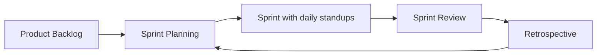
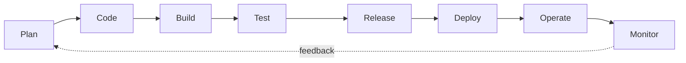

# Day 02 · SDLC, Agile and the DevOps Lifecycle

📅 **Date:** 03 Oct 2026 · ⏱️ **Time:** ~2 hrs · 🎥 **Source:** Abhishek Veeramalla, "Day-2 | Improve SDLC with DevOps" + self-study

## 📌 At a glance

| | |
|---|---|
| **Topic** | How software is built (SDLC), Agile ways of working, and where DevOps fits in |
| **Key idea** | Agile speeds up building software. DevOps speeds up delivering and running it |
| **Outcome** | Can explain SDLC, Waterfall vs Agile, Scrum and Kanban in an interview |

---

## 1. What is SDLC?

**SDLC (Software Development Life Cycle)** is the step-by-step process every piece of software goes through, from the first idea to a product that users rely on.

> **Analogy:** Building a house. You plan, draw a blueprint, construct, inspect, move in, and keep repairing. Software follows the same pattern.

```text
Planning → Requirements → Design → Development → Testing → Deployment → Maintenance
```

## 2. The 7 phases of SDLC

| # | Phase | What happens | Output | Example (MERN app) |
|---|-------|--------------|--------|--------------------|
| 1 | **Planning** | Decide what to build, the scope, time, cost and team | Project plan | "We will build a wardrobe app" |
| 2 | **Requirements** | Collect what users actually need | User stories / requirements document | "Users can add clothes and get outfit suggestions" |
| 3 | **Design** | Plan the architecture, database and screens | Architecture, database schema, wireframes | MongoDB schema, REST API list, UI mockups |
| 4 | **Development** | Write the code | Working source code | React frontend, Node/Express backend |
| 5 | **Testing** | Find and fix bugs | Test reports | Does login work? Does the API return correct data? |
| 6 | **Deployment** | Release the software to users | Live application | App running on a server |
| 7 | **Maintenance** | Fix bugs, add features, keep it running | Patches and updates | Fix issues from user feedback |

## 3. Waterfall vs Agile

### Waterfall (traditional model)
Each phase is **fully finished** before the next one begins, like water flowing down steps. There is no going back.

- ✅ Simple and easy to manage for small, fixed projects
- ❌ Changing requirements is hard and expensive
- ❌ Users see the product only at the very end
- ❌ Bugs are found late, when fixing them costs the most

### Agile (modern model)
Work is split into **small pieces** delivered in short cycles. After each cycle the team gets feedback and adjusts.

- ✅ Changes are easy to handle
- ✅ Early and frequent feedback
- ✅ Some working software reaches users quickly
- ❌ Needs close collaboration and discipline from the team

| | Waterfall | Agile |
|---|---|---|
| **Approach** | One phase completes before the next | Small pieces in short cycles |
| **Changes** | Hard and costly | Welcome and easy |
| **Feedback** | Very late | Early and frequent |
| **Releases** | One big release | Small, frequent releases |
| **Risk** | High (problems found late) | Lower (problems found early) |
| **Best for** | Fixed, well-known requirements | Changing or unclear requirements |

### The 4 Agile values (Agile Manifesto)
1. Individuals and interactions over processes and tools
2. Working software over comprehensive documentation
3. Customer collaboration over contract negotiation
4. Responding to change over following a plan

## 4. Scrum (the most popular Agile framework)

Scrum organises work into **sprints**. A sprint is a short cycle of 1 to 4 weeks (commonly 2 weeks) in which the team finishes a small, usable part of the product.

### Key terms

| Term | Meaning | Example |
|------|---------|---------|
| **Sprint** | A fixed work cycle of 1 to 4 weeks | A 2-week sprint |
| **Product Backlog** | The complete wishlist of everything to build | Login, add clothes, suggest outfits, share, dark mode |
| **Sprint Backlog** | The items chosen for the current sprint only | Login and add clothes |
| **User Story** | A feature described from the user's view: *As a [user], I want [feature], so that [benefit]* | "As a user, I want to add my clothes so that I can see my wardrobe" |
| **Daily Standup** | A 15-minute daily sync: what I did, what I'll do, any blockers | Every morning |
| **Sprint Review** | Demo of the finished work to get feedback | End of the sprint |
| **Retrospective** | The team reflects on how it worked and how to improve | After the review |

### Scrum roles

| Role | Responsibility |
|------|----------------|
| **Product Owner** | Decides what to build and in what order of priority |
| **Scrum Master** | Helps the team follow Scrum and removes blockers. Not a boss |
| **Development Team** | Designs, builds and tests the product |

### The Scrum cycle



## 5. Kanban

Kanban is a visual board that shows the state of every task. Each task is a card that moves from left to right.

| To Do | In Progress | Done |
|-------|-------------|------|
| Add dark mode | Build login page | Set up project |
| Write API docs | | Design database |

- No fixed sprints. Work flows continuously
- Teams limit how many cards can be "In Progress" at once (the WIP limit) to avoid overload
- Trello and Jira boards work this way

| | Scrum | Kanban |
|---|---|---|
| **Cycle** | Fixed sprints | Continuous flow |
| **Roles** | Product Owner, Scrum Master, Dev Team | No required roles |
| **Planning** | At the start of each sprint | Whenever there is capacity |
| **Best for** | Feature-driven product teams | Support and operations work |

## 6. How DevOps improves SDLC

Agile made **planning and building** faster. But code still waited on slow, manual testing, deployment and operations. DevOps fills that gap with automation and shared ownership.

| SDLC phase | Without DevOps | With DevOps |
|------------|----------------|-------------|
| Development | Large, infrequent code drops | Small changes, committed often to Git |
| Testing | Manual testing late in the cycle | Automated tests on every change |
| Deployment | Manual steps, high chance of error | Automated, repeatable pipeline |
| Maintenance | Problems found by users | Monitoring and alerts catch issues early |

> **Agile = build faster. DevOps = deliver and run faster, and safely.**

## 7. Interview answers

**Q: What is SDLC?**
> "SDLC is the process of planning, building, testing, deploying and maintaining software. Its phases are planning, requirements, design, development, testing, deployment and maintenance."

**Q: What is the difference between Waterfall and Agile?**
> "Waterfall completes each phase fully before moving on, so changes are costly and feedback comes late. Agile delivers work in small iterations with continuous feedback, so it adapts to change much faster."

**Q: What is Scrum?**
> "Scrum is an Agile framework where a team works in short sprints, usually two weeks. It uses a product backlog, daily standups, a sprint review and a retrospective to deliver working software step by step."

**Q: How does DevOps relate to Agile?**
> "Agile speeds up how we plan and build software. DevOps extends that speed to testing, deployment and operations through automation and collaboration."

---

## 🛠️ Practical: Trello board for my project

- [ ] Create a free Trello board for my MERN project
- [ ] Add 3 columns: **To Do**, **In Progress**, **Done**
- [ ] Add 8 to 10 cards as my **Product Backlog**
- [ ] Choose 3 cards for a **2-week mini sprint** and move them to In Progress
- [ ] Write one user story in the format *As a [user], I want [feature], so that [benefit]*


---

# 🔁 Part 2 · The DevOps Lifecycle (Day 03)

## 8. What is the DevOps lifecycle?

The DevOps lifecycle is the set of **8 stages** that code goes through, from an idea to running in production. It is a **continuous loop**, not a straight line, because feedback from running software feeds back into planning.



## 9. The 8 stages explained

Example feature: **"Favorite outfit"** in a wardrobe app.

| # | Stage | What happens | Example |
|---|-------|--------------|---------|
| 1 | **Plan** | Decide what to build, who builds it and by when | Trello card: "User can mark an outfit as favorite" |
| 2 | **Code** | Write the feature and save it in Git | React button and Node API, then `git push` |
| 3 | **Build** | Turn the code into a runnable package | Source code becomes an app or Docker image |
| 4 | **Test** | Check that nothing is broken | Automated tests: "Does the favorite button work?" |
| 5 | **Release** | Approve a tested version for users | Version `v1.2` is tagged after tests pass |
| 6 | **Deploy** | Put the version on servers | New version goes live on the server |
| 7 | **Operate** | Keep it running: servers, scaling, security | Capacity grows when traffic rises |
| 8 | **Monitor** | Watch performance, errors and uptime | Dashboard and alerts show the button is slow |

Monitoring feedback ("the button is slow") becomes the next **Plan**, and the loop continues.

## 10. Tools for each stage (preview)

| Stage | Example tools | Covered in |
|-------|---------------|------------|
| Plan | Jira, Trello | Phase 1 |
| Code | Git, GitHub | Phase 4 |
| Build | npm, Docker | Phase 6 |
| Test | Jest, Selenium | Phase 7 |
| Release | GitHub Actions, Jenkins | Phase 7 |
| Deploy | Docker, Kubernetes, Terraform | Phases 5, 6, 8, 9 |
| Operate | Linux, AWS, Kubernetes | Phases 2, 5, 9 |
| Monitor | Prometheus, Grafana, CloudWatch | Phase 10 |

The whole roadmap is this lifecycle, learned one stage at a time.

## 11. CI and CD

| Term | Full form | What it does | Stages automated |
|------|-----------|--------------|------------------|
| **CI** | Continuous Integration | Automatically builds and tests code on every push | Code → Build → Test |
| **CD** | Continuous Delivery / Deployment | Automatically releases and deploys tested code | Release → Deploy |

> **CI** = merge and test code often. **CD** = deliver tested code to users automatically.

## 12. Why the lifecycle matters

1. **Find bottlenecks:** if deployment takes two days, that stage needs automation.
2. **Shared language:** "it failed at the test stage" tells everyone where the problem is.
3. **Automation targets:** look at each stage and ask what is still manual.

## 13. Interview answers (Day 03)

**Q: Explain the DevOps lifecycle.**
> "The DevOps lifecycle is a continuous loop of eight stages: plan, code, build, test, release, deploy, operate and monitor. Code is planned and written, built into an artifact, tested automatically, released, deployed to servers, operated in production and monitored. Monitoring feedback goes back into planning, so the product keeps improving."

**Q: What is CI/CD?**
> "CI automatically builds and tests code on every commit. CD automatically releases and deploys the tested code to environments, so delivery is fast and repeatable."

## ✅ Key takeaways

1. SDLC is the 7-step journey of software, from planning to maintenance.
2. Waterfall finishes each phase before the next. Agile works in small, feedback-driven iterations.
3. Scrum uses sprints, backlogs, daily standups, a review and a retrospective.
4. Kanban is a continuous-flow board: To Do, In Progress, Done.
5. Agile speeds up development. DevOps speeds up delivery and operations.
6. 6. The DevOps lifecycle has 8 stages (plan, code, build, test, release, deploy, operate, monitor) and runs as a continuous loop.
7. CI automates build and test. CD automates release and deploy.


⬅️ [Day 01](../day-01/README.md) · 🏠 [Main README](../../README.md) · ➡️ Next: Day 03, Environments and Architecture
