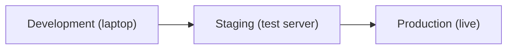
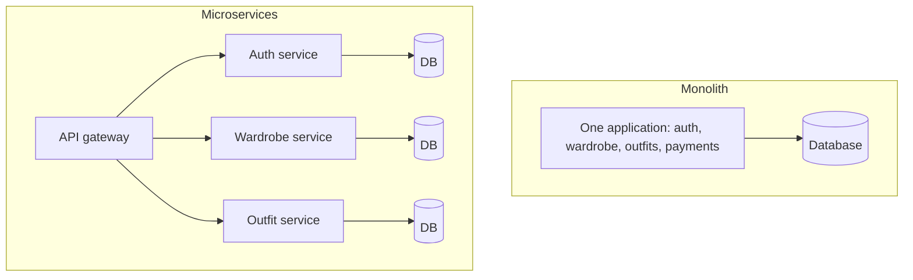

# Day 03 · Environments and Application Architecture

📅 **Date:** 04 Oct 2026 · ⏱️ **Time:** ~2 hrs · 📚 **Source:** Self-study

## 📌 At a glance

| | |
|---|---|
| **Topics** | Development, staging and production environments, config vs code, monolith vs microservices |
| **Key idea** | Code moves safely through separate environments, and the same code runs everywhere with different config |
| **Outcome** | Can explain environments, why they must match, and when to choose monolith or microservices |

---

# Part A · Environments

## 1. What is an environment?

An **environment** is a separate place where an application runs, each with its own purpose.

> **Analogy:** A restaurant tests a new dish in the kitchen, then with staff, and only then serves it to customers. Software follows the same path.

## 2. The three main environments

| Environment | Used by | Purpose | Restaurant analogy |
|-------------|---------|---------|--------------------|
| **Development (Dev)** | Developers | Write code and experiment. Breaking things is fine | The chef's kitchen |
| **Staging** | Team and testers | Final checks in a setup that mirrors production | Staff taste test |
| **Production (Prod)** | Real users | The live application. Mistakes cost real users | Food served to customers |

A separate **Testing/QA** environment is sometimes added for feature testing.

## 3. The path of a code change



> **Never change production directly.** Every change goes through dev and staging first.

## 4. Why keep them separate?

1. **Safety:** a failure in dev affects nobody. A failure in production affects every user.
2. **Catch bugs early:** staging reveals problems that do not appear on a laptop.
3. **Protect real data:** dev uses fake data. Real user data lives only in production.

## 5. What differs between environments?

Example: a MERN application.

| Item | Development | Staging | Production |
|------|-------------|---------|------------|
| **Database** | Local MongoDB, fake data | Separate test database | Real database with backups |
| **API URL** | `localhost:5000` | `staging.myapp.com` | `myapp.com` |
| **Secrets and keys** | Test keys | Test keys | Real secret keys |
| **Errors** | Full error details shown | Full error details shown | Users see a simple message, details go to logs |
| **Server** | Developer laptop | Small server | Larger, secured server |

## 6. Keep config separate from code

Values that change between environments (database URL, API keys, passwords) must **not** be written inside the code. They live in **configuration**, such as environment variables or a `.env` file.

```bash
# Development .env
MONGO_URL=mongodb://localhost:27017/myapp

# Production .env (on the production server only)
MONGO_URL=<real production database URL>
```

- The **same code** runs in every environment. Only the config changes.
- Add `.env` to `.gitignore`. **Never commit secrets to GitHub.**

## 7. The core problem: environments that drift apart

If dev and production differ (Node version, settings, packages), the classic **"works on my machine"** problem appears. A core DevOps goal is to make environments **consistent and reproducible**:

- **Docker** packages an app so it runs the same everywhere (Phase 6).
- **Terraform** creates servers and infrastructure from code (Phase 8).

## 8. Production golden rules

1. Do not make direct changes in production.
2. Test in staging first.
3. Never hard-code secrets.
4. Keep backups and a rollback plan (the ability to return to the previous version).

---

# Part B · Monolith vs Microservices

## 9. Monolith

The whole application is **one codebase deployed as one unit**: login, wardrobe, outfits and payments together.

> **Analogy:** A thali. Everything is on one plate. Changing one item means remaking the whole plate.

## 10. Microservices

The application is split into **small, independent services**. Each service does one job, has its own code and deployment, and talks to others through **APIs**.

> **Analogy:** A buffet. Each counter is separate. Changing one counter does not disturb the others.

Example for a wardrobe app:
- **Auth service:** signup and login
- **Wardrobe service:** add, edit and delete clothes
- **Outfit service:** suggest outfits
- **Notification service:** send reminders



## 11. Comparison

| | Monolith | Microservices |
|---|----------|---------------|
| **Structure** | One large application | Many small services |
| **Getting started** | Simple and fast | More setup and complexity |
| **Deployment** | The whole app together | Each service independently |
| **Scaling** | Scale the entire app | Scale only the busy service |
| **If one part fails** | The whole app may go down | Usually only that service is affected |
| **Debugging** | Easier, everything in one place | Harder, spread across services |
| **Team size** | Good for small teams | Good for large teams owning separate services |
| **Technology** | One tech stack | Each service can use a different stack |

## 12. Which one to choose?

- **Monolith:** small team, new product, need to launch quickly. Most startups begin here.
- **Microservices:** large application, multiple teams, and parts that need to scale independently.

> Microservices are not always better. They add operational complexity and can make things harder when used too early.

## 13. Why this matters for DevOps

Many small services must be built, deployed, monitored and scaled. Doing this by hand is impractical, which is why **Docker** (packaging each service), **Kubernetes** (running many services) and **CI/CD** (automatic delivery) are central to DevOps.

---

## 💬 Interview answers

**Q: What are the different environments in software delivery?**
> "Typically there are development, staging and production environments. Developers build and experiment in development, staging mirrors production for final testing, and production serves real users. Separating them keeps changes safe and catches bugs before users see them."

**Q: Why separate configuration from code?**
> "Settings such as database URLs and API keys differ across environments. Keeping them in environment variables or config files lets the same code run everywhere unchanged, and keeps secrets out of the repository."

**Q: Monolith vs microservices?**
> "A monolith is a single deployable application, which is simple to build and debug. Microservices split the app into small independent services that can be deployed and scaled separately, but they add operational complexity. Small teams usually start with a monolith and move to microservices as the system and team grow."

---

## ✅ Key takeaways

1. There are three main environments: development, staging and production.
2. Changes flow dev → staging → production. Never change production directly.
3. Keep configuration (`.env`) separate from code, and never commit secrets.
4. Consistent environments prevent "works on my machine". Docker and Terraform help later.
5. A monolith is one deployable app. Microservices are many independent services.
6. Start with a monolith, and move to microservices when scale and team size demand it.


Foundations covered: DevOps culture, SDLC and Agile, the DevOps lifecycle, environments, and monolith vs microservices. **Next: Phase 2, Linux and Bash scripting.**

⬅️ [Day 02](../day-02/README.md) · 🏠 [Main README](../../README.md)
